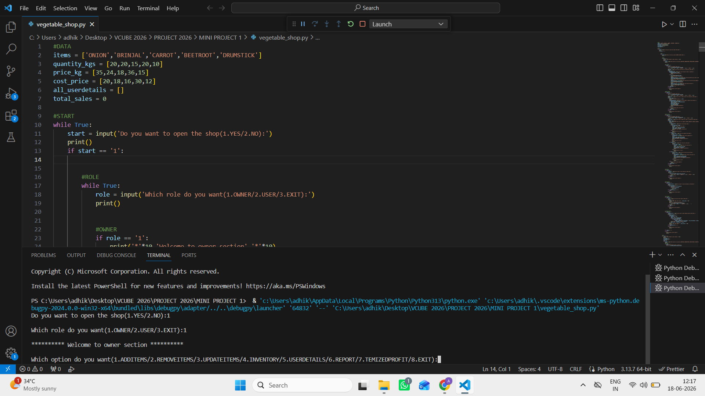
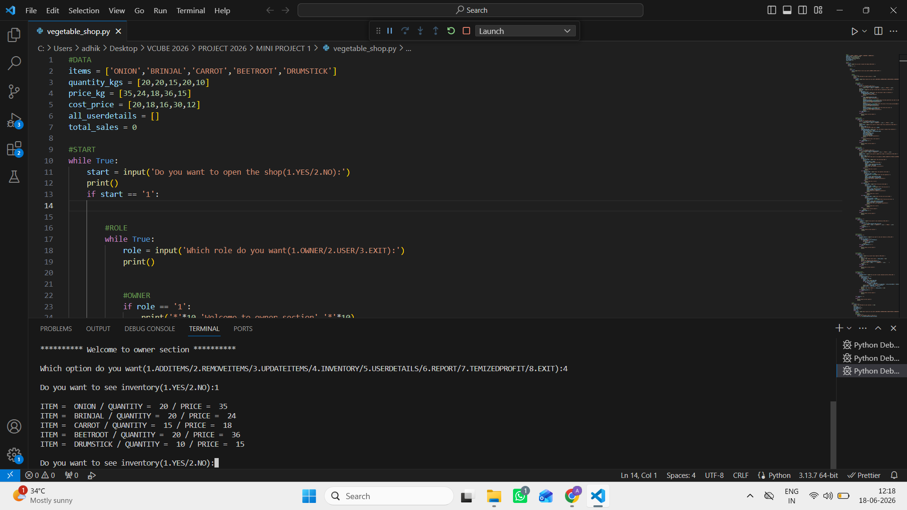
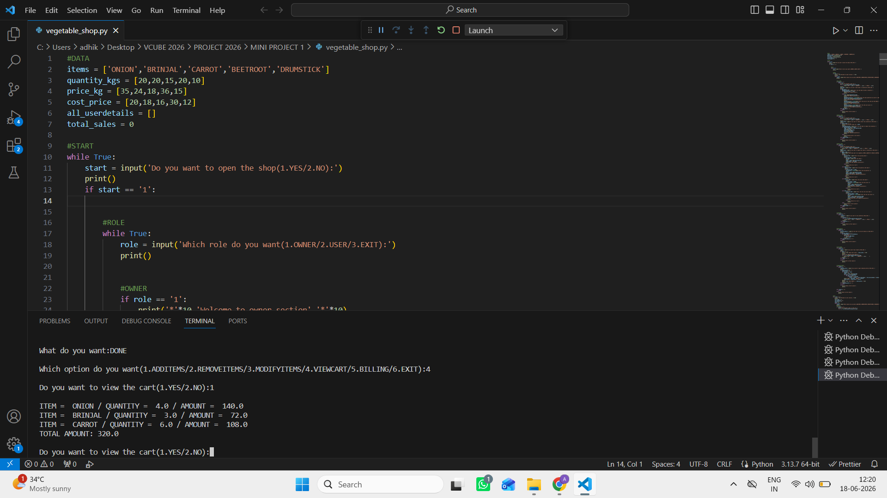
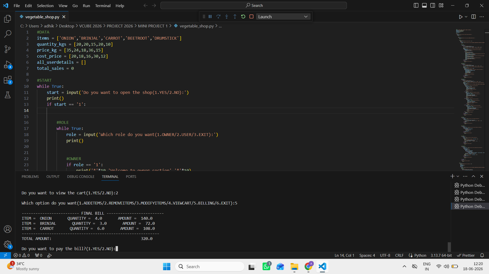
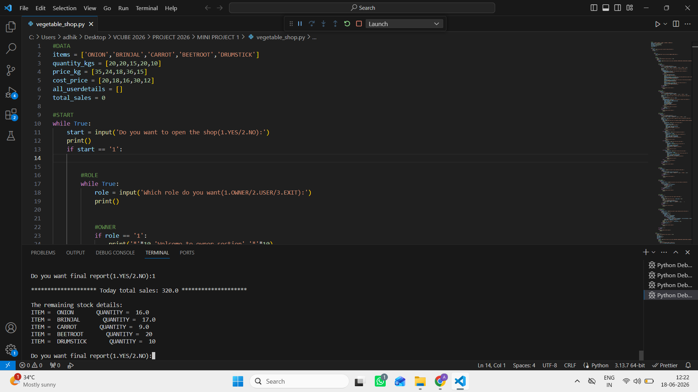

# Vegetable Shop Management System

## Description
A Python-based Vegetable Shop Management System with Owner and User modules.

## Features
- Add, Remove, and Update Inventory
- Cart Management
- Billing System
- Sales Reports
- Profit Calculation

## Technologies Used
- Python

## How to Run

```bash
python vegetable_shop.py
```

## Author
Swamy Naidu

## Screenshots

### Owner Menu


### Inventory


### Cart


### Billing


### Report

